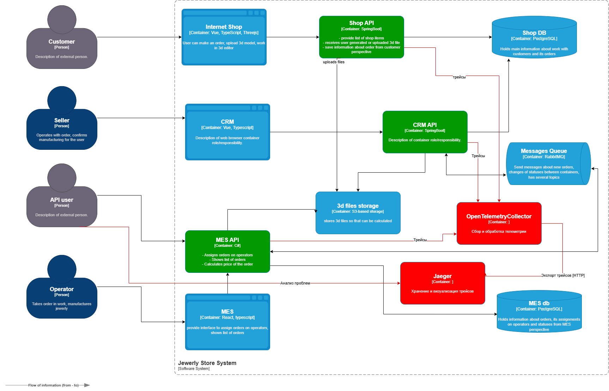

> [!NOTE]
> 2. **Проанализируйте систему компании и C4-диаграмму в контексте планирования трейсинга.** Напишите и выделите на схеме системы, которые следует покрыть трейсингом. Для этого идентифицируйте места, где заказ может «сломаться» или зависнуть.
>     
>     Составьте список данных, которые должны попадать в трейсинг

(диаграмма далее, системы для сбора трейсов показаны зеленым цветом)


> [!NOTE]
> 3. **Добавьте в файл раздел «Мотивация».** Напишите здесь, почему в систему нужно добавить трейсинг и что это даст компании. Опишите возможные три-пять технические и бизнес-метрики решения, на которые повлияет внедрение трейсинга.

**Мотивация:**
> Трейсинг помогает быстро находить причины, например, медленной работы сервиса. Вместо просмотра всей цепочки вызовов, которую нужно к тому же раскрутить, разработчик может посмотреть, сколько, где и с какими параметрами прошёл вызов. У трейсинга как средства устранения неполадок есть дополнительные преимущества, поскольку любое исключение или ошибка обычно фиксируется вместе со всем контекстом запроса.

Что в итоге даст пользователям более положительный опыт пользования программным продуктом, и в конечном счете положительно отразится на репутации и прибыли компании.

##### Метрики
- Среднее время расчёта стоимости в MES
	- Позволяет выявить, нужно ли оптимизировать алгоритмы или добавлять кеширование.
- Количество сообщений в очередях RabbitMQ
	- Позволяет обнаружить сбои в передаче заказов.
- Процент просроченных заказов
	- Прямой показатель неэффективности.
- Конверсия на этапе «Расчёт стоимости → Оплата»
	- Низкая конверсия означает, что клиентов не устраивает цена или время расчёта.
	- Помогает корректировать ценовую политику.


> [!NOTE]
> 4. **Добавьте раздел «Предлагаемое решение».** Опишите, как и с помощью каких технологий будет реализован трейсинг, какие компоненты нужно внедрить или доработать. Отразите компоненты и новые связи на схеме. Скачайте [диаграмму контейнеров](https://code.s3.yandex.net/software-architect/jewerly_c4_model.drawio?etag=3fd9b7afd2890dfd40ae2217e418e9fa) Александрита» в модели C4. Доработайте диаграмму, исходя из вашего решения: отразите на ней новые компоненты и связи. Новые элементы выделяйте красным цветом — так ревьюеру будет проще проверить вашу работу. Когда схема будет готова, добавьте ссылку на неё в раздел «Предлагаемое решение».


##### Предпологаемое решение:

Использование **OpenTelementry**:
1. Добавить OpenTelemetry SDK в сервисы, которые будут отправлять трейсы.
2. Добавить два основных атрибута `trace_id` и `span_id`через специальные заголовки, которые добавляются в каждый HTTP- или gRPC-запрос, а также в заголовки сообщений для очередей.
Использование **Jaeger**:
3. Развернуть Jaeger-All-in-One, настроить и cконфигурировать, например

**Jaeger:**
```
docker run -d --name jaeger \
  -p 16686:16686 \  # UI
  -p 6831:6831/udp \  # UDP-порт для приёма данных
  jaegertracing/all-in-one
```

**opentelemetry-collector-config.yaml:**
```
exporters:
  jaeger:
    endpoint: "jaeger:14250"
    insecure: true
```

> [!NOTE]
> 5. **Добавьте раздел «Компромиссы».** Опишите, в каких случаях трейсинг не принесёт пользы или пока невозможен, или его реализация обойдётся слишком дорого.
> 
> Например, сложно заставить проприетарную систему отдавать метрики в нужном формате, может потребоваться дорогостоящая доработка.

**Компромиссы:**
	- Иногда нет сторонних SDK для платформ, внедрение будет затруднено
	- Трассировка увеличивает Latency, там, где важно быстродействие, может быть не оправдано
	- Если система достаточно простая, может быть достаточно логирования
	- Нужны ресурсы для поддержки, которые можно было бы направить на более полезные работы.

> [!NOTE]
> 6. **Проработайте аспекты безопасности.** Опишите, какие меры для предотвращения несанкционированного доступа будут предусмотрены для системы трейсинга внутри компании и снаружи если это требуется.
>     
>     Например: «Внедрение аутентификации — зайти в систему смогут только сотрудники компании с актуальной учетной записью и ролью “Поддержка”».

1. **Шифрование** трейсов в транзите и при хранении.
	1. TLS (HTTPS/gRPC)
	2. Шифрование сообщений RabbitMQ (если трейсы передаются через очереди)
	3. Маскировка персональных данных в трейсах
	4. Исключение из трейсов паролей, токенов, платежных данных
2. Доступ к **Jaeger**. 
	1. SSO
	2. RBAC
	3. JWT
	4. Сегментация сети
3. **Изоляция** данных партнёров через фильтрацию.
4. **Мониторинг аномалий** (SIEM + алёрты).
5. **Автоматическое удаление** старых трейсов.
