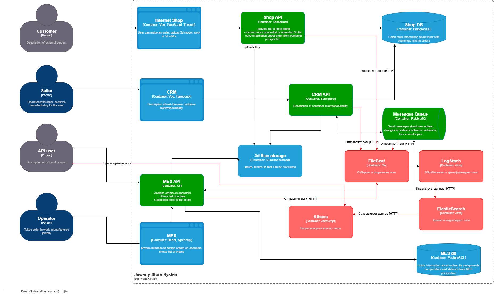

> [!NOTE]
> 2. **Проанализируйте систему компании и C4-диаграмму в контексте планирования логирования.** Опишите, какие логи нужно собирать и отметьте на схеме, из каких систем требуется сбор логов. Составьте список необходимых логов с уровнем INFO.
>     
>     Например, изменение статуса заказа. Логируем время, идентификатор покупателя, номер заказа.
>     
>     Напишите, будете ли вы использовать другие уровни логирования и при каких обстоятельствах
 
(диаграмма далее - системы для сбора отмечены зеленым)

2. Описание логов:
- `Severity`
	- Info - информационные сообщения о штатных механизмах работы, например аудит безопасности, прохождение чекпоинтов.
	- Warning - предупреждения о некорректной, подозрительной, но допустимой работе системы, например ошибки валидации
	- Error - предсказанные сбои в работах систем - например обрывы соединений.
	- Critical - непредсказанные сбои в работах систем  - например NRE, COM Ex, отличаются от Error тем, что программно не обработаны, а значит восстановление работоспособности после таких ошибок не гарантировано, даже если программа продолжает работать на первый взгляд правильно.
	- Debug - для отладки. Индивидуальны для каждых кейсов.
- `Source` - источник записи, сервис, модуль
- `TimeStamp` (UTC) - время записи вплоть до мс.
- `Message` - Отображаемое краткое описание записи логирования.
- `Data` - словарь ключ-значение с дополнительными свойствами, например:
	- `ValidationErrors`\[] - ошибки валидации
	- `StackTrace` - трейс программного потока
	- `Url` - Если сбой происходит в контексте работы HTTP-запроса
	- `RequestBody` (в зависимости от чувствительности к безопасности) - тело HTTP запроса
	- `UserID`  - Пользователь из контекста HTTP-запроса.
	- `OrderID` - Если сбой происходит в контексте работы с Заказом
	- `MeshID` - Если сбой происходит в контексте работы с Моделью
	- и др.
	
##### Логи **MES Api**, как критического компонента инфраструктуры:
- INFO:
	- изменение статуса заказа
	- успешный расчет стоимости заказа
- WARN:
	- высокое количество полигонов в модели
	- превышено среднее время расчета модели
	- отмена заказа пользователем
	- отмена заказа сервисом
- ERROR:
	- Ошибка 3D модели (разрыв полигонов, неверный масштаб, превышение максимально допустимого количества полигонов, неверный формат данных) - можно вывести на уровень WARN, что бы не засирать важные логи, если пользователи дурачки (как InternalError для отмены заказа сервисом)
	- Ошибки HTTP (в том числе по таймауту)
	- Ошибки инфраструктуры сервиса: ORM, маппинг/сериализация, конфигурация
	- Ошибки PostgreSQL
	- Программная ошибка модуля расчетов (в том числе по таймауту)
	- Все остальные обработанные и предвиденные ошибки в работе сервиса
- CRIT:
	- Все остальные необработанные и непредвиденные ошибки (500)

##### Логи **MessageQueue**
- INFO: 
	- Сообщение успешно отправлено в очередь  
	- Сообщение получено из очереди  
- WARN:
	- Повторная отправка сообщения.  
	- Долгая обработка сообщения.  
	- Некорректное сообщение.
- ERROR/CRIT:
	- Не удалось опубликовать сообщение в очередь.  
	- Ошибка десериализации сообщения.  
##### Логи **ShopApi** (интернет магазин):
- INFO:
	- Изменения статуса заявки  
	- Успешная оплата
	- Регистрация нового пользователя (если есть домен пользователей)
	- Загрузка новой 3D модели
- WARN
	- Повторная/Неудачная оплата.
	- Неверный логин/пароль 5 раз подряд
	- Превышен максимально допустимый размер файла 3D модели
	- Отмена заявки
	- и др
- ERROR:
	- Ошибки HTTP
	- Ошибки инфраструктуры сервиса
	- Ошибки БД
	- Недоступность вызова внешнего API (например, платёжного шлюза).


> [!NOTE]
> 3. **Добавьте в файл раздел «Мотивация».** Напишите здесь, почему в систему нужно добавить логирование и что это даст компании. Опишите три-пять технические и бизнес-метрики решения, на которые может повлиять внедрение логирования.
>     
>     Команда не сможет реализовать единовременно логирование и трейсинг всех выделенных для этого систем. Поэтому опишите, для каких систем нужно настраивать логирование и трейсинг в первую очередь и почему.

#### Мотивация:
- Логирование, как часть комплексной системы мониторинга, позволит выявлять конкретные сбои в работе системы, и оперативно реагировать.
- Пример 3-5 технические и бизнесс-метрики решения, на которые может повлиять внедрение логирования:
	- Время выполнения заказа
	- Среднее время расчёта стоимости в MES
	- Процент отменённых/просроченных заказов
	- Загрузка производственных мощностей
	- Частота использования API партнёрами

#### Что логировать в первую очередь:
**MES:**
- Время расчёта стоимости для каждого заказа + количество полигонов в модели
- Загрузка сервера (CPU, память) в момент расчёта.
**Интеграция CRM ↔ MES (RabbitMQ):**
- Количество сообщений в очередях.
- Время обработки сообщений
- Dead-letter queue
**API для B2B-партнёров:**
- Latency и статус-коды API.
- Количество запросов от каждого партнёра.
- Заказы, созданные через API.


> [!NOTE]
> 4. **Добавьте раздел «Предлагаемое решение».**
>     
>     Опишите, как и с помощью каких технологий будет реализовано логирование, какие компоненты нужно внедрить или доработать. Отразите компоненты и новые связи на схеме.
>     
>     Проработайте политику безопасности в отношении логов — как будет происходить работа с чувствительными данными, кто будет иметь доступ к логам.
>     
>     Проработайте политику хранения в отношении логов — будет ли это отдельный индекс под систему, сколько они будут храниться и какого размера будут.




#### Предлагаемое решение
1. Внедрить в сервисы сбор и отправку логов, например Serilog в Asp.Net Mes Api.
2. Далее необходимо внедрить систему агентов, например FileBeat, которые будут агрегировать данные, и отправлять их далее в конвеер.
3. Развернуть LogStach для конвеерной обработки логов и отправки их в хранилище
4. Развернуть ElasticSearch для хранения логов
5. Развернуть Kibana для визуализации документов из ElasticSearch

Как (ELK ): docker-compose.yaml (сервисы) + Nginx + FileBeat как пример агента
```
 version: "3"
 
 services:
   elasticsearch:
     image: elasticsearch:8.14.3
     volumes:
       - ./conf/elasticsearch/conf.yml:/usr/share/elasticsearch/config/elasticsearch.yml:ro
       - ./elasticsearch/data:/usr/share/elasticsearch/data
     environment:
       ES_JAVA_OPTS: "-Xmx1G"
       ELASTIC_USERNAME: "elastic"
       ELASTIC_PASSWORD: "sampleELK"
       discovery.type: single-node
     networks:
       - elknet
     ports:
       - "9200:9200"
       - "9300:9300"
 
   logstash:
     image: logstash:8.14.3
     volumes:
       - ./conf/logstash/conf.yml:/usr/share/logstash/config/logstash.yml:ro
     environment:
       LS_JAVA_OPTS: "-Xmx512m -Xms512m"
     ports:
       - "5044:5044"
       - "5010:5000"
       - "9600:9600"
     networks:
       - elknet
     depends_on:
       - elasticsearch
 
   kibana:
     image: kibana:8.14.3
     depends_on:
       - elasticsearch
     volumes:
       - ./conf/kibana/conf.yml:/usr/share/kibana/config/kibana.yml:ro
     networks:
       - elknet
     ports:
       - "5601:5601"

  beats:
    image: elastic/filebeat:8.14.3
    volumes:
      - ./conf/filebeat/conf.yml:/usr/share/filebeat/filebeat.yml:ro
      - ./var/log/nginx:/var/log/nginx
    networks:
      - elknet
    depends_on:
      - nginx
      - elasticsearch

   nginx: 
     image: nginx:latest
     volumes:
       - ./conf/nginx/nginx.conf:/etc/nginx/nginx.conf
       - ./var/log/nginx:/var/log/nginx
     networks:
       - elknet
     ports:
       - 80:80
 

 networks:
   elknet:
     driver: bridge

```
\+ Файлы конфигурации
#### Политика безопасности:
1. **Минимизация доступа** (принцип наименьших привилегий).
	1. **Встроенные роли Elasticsearch:**
		1. `superuser` – только для 2-3 администраторов.
		2. `logstash_writer` – только для записи логов (используется Logstash).
		3. `kibana_user` – для аналитиков (только чтение).
	2. **Ролевая модель в Kibana:**
		1. `security_auditor` - Просмотр логов, но не удаление.
		2. `dev_ops` -Полный доступ к логам, но не к настройкам безопасности.
		3. `support` - Только определённые индексы (например, `logs-nginx-*`).
		4. Запрет дефолтных ролей (`superuser`, `kibana_admin` для рядовых пользователей).
2. **Шифрование данных:** 
	1. **В транзите:**
		1. HTTPS для Kibana и Elasticsearch API.
		2. TLS для передачи данных между Logstash и Elasticsearch.
	2. **На диске:**
		1. Шифрование томов Elasticsearch.
		2. Регулярное ротирование ключей шифрования.
3. **Маскировка PII**
	1. Использование Logstash-фильтров для замены чувствительных данных
	2. Индексы с PII помечаются тегами (`pii: true`) и шифруются отдельно
4. **Аудит всех действий** в Elasticsearch.
5. **Резервные копии + TTL**.
6. **Алерты:**
	1. Попытки доступа к индексу `logs-pii-*`.
	2. Удаление более 1000 документов за 1 минуту.
7. **Обучение персоонала основам безопасности**

#### Политика хранения логов
- **Отдельные индексы под каждую систему**:
	- mes-logs-<дата>
	- crm-logs-<дата>
	- mq-logs-<дата>
- **Резервное копирование:**
	- Ежедневные снапшоты Elasticsearch
	- Шифрование бэкапов
- **TTL (время жизни логов):**
	- MES - 30 дней (Оптимально для анализа инцидентов)
	- CRM - 90 дней (Требования к финансовой отчетности)
	- Аудит - 1 год (Юридические требования)
	- PII-данные - 7 дней (Соответствие GDPR/ФЗ-152)
- **Холодное хранение:**
	- Старые логи (>30 дней) перемещаются в Архив S3.
- **Ограничение размена:**
	- Макс. размер индекса - 50 gb
	- Всего места под логи - 2 tb

> [!NOTE]
> 5. **Проработайте необходимые мероприятия для превращения системы сбора логов в систему анализа логов:**
>     
>     Нужно ли настроить какой-то алертинг?
>     
>     Нужно ли искать аномалии? Например, было четыре записи о создании заказов и за секунду их стало 10 000. Возможно, происходит DDoS-атака конкурентами.

Для анализа логов можно использовать Grafana с datasource ElasticSearch. 
Для алертинга использовать плагин Grafana Alert
Нужно создать Allert Rule, например:

**DDoS:**
- Запрос в ElasticSearch:
```
{
  "query": {
    "bool": {
      "must": [
        { "range": { "@timestamp": { "gte": "now-1m" } } },
        { "terms": { "response.keyword": ["503", "429"] } }
      ]
    }
  },
  "aggs": {
    "ips": { "terms": { "field": "ip.keyword", "size": 10 } }
  }
}
```

- Когда: `sum(of responses) > 1000 за 1 минуту`
- Условие: `is above() 1000`

**Брутфорс:**
- Запрос:
```
{
  "query": {
    "bool": {
      "must": [
        { "term": { "path.keyword": "/login" } },
        { "range": { "@timestamp": { "gte": "now-5m" } } }
      ]
    }
  },
  "aggs": { "failed_logins": { "value_count": { "field": "ip.keyword" } } }
}
```
- Когда: `failed_logins > 50 за 5 минут`

Можно настроить уведомления, дашборды, или блокировки через Webhook