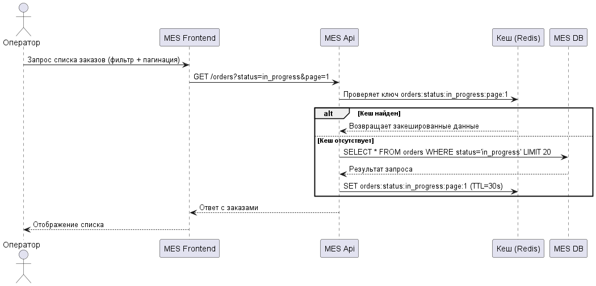
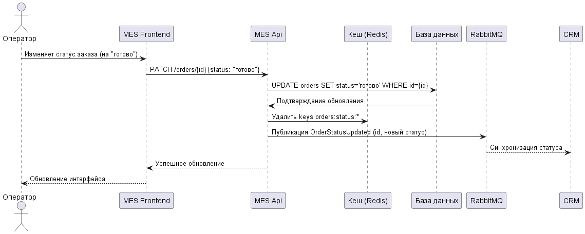

> [!NOTE]
> 2. **Проанализируйте диаграмму системы и её описание.** Решите, какую часть системы имеет смысл закешировать.

Критически важно закешировать:
1. Расчеты моделей
	1. Узкое место в системе. Так как используются модели из галереи, происходит расчет стоимости для одних и тех же моделей.
2. Список заказов
	1. Частые запросы к базе данных со списком заказов дополнительно нагружают сервер.

> [!NOTE]
> 3. **Добавьте в файл раздел «Мотивация».** Опишите здесь, почему вы предлагаете внедрить кеширование, какие проблемы оно должно решить и какие элементы системы вы планируете включить в кеширование.

#### **Мотивация:**
- **Расчеты моделей** - уменьшение среднего времени расчета стоимости 3Д модели.
- **Список заказов** - уменьшение времени загрузки списка заказов и уменьшение среднего времени расчета 3Д модели за счет освобождения ресурсов под вычислительные задачи

**элементы системы для внедрения:**
- Redis

> [!NOTE]
> 4. **Добавьте раздел «Предлагаемое решение».** Определите, какое кеширование вы будете внедрять — клиентское или серверное. Объясните, почему, на ваш взгляд, нужно использовать именно его. Если вы решите куда-то внедрить серверное кеширование, то поясните, какой паттерн будете применять — Cache-Aside, Write-Through или Refresh-Ahead. А также объясните, почему вы выбрали этот паттерн и почему остальные паттерны не подойдут или покажут себя хуже.

#### Предлагаемое решение:
Разумнее внедрять серверное кеширование, потому как:

1. Статусы заказов могут часто изменяться, могут использоваться однотипные запросы, которые можно вынести в БД на уровень материализованных представлений и индексов, что снизит нагрузку на MES.
2. Серверное кеширование лучше работает с фильтрацией и пагинацией
3. Возможности асинхронной загрузки данных с прогрессивным отображенем
4. Для расчетов стоимости 3D моделей клиентское кеширование не подходит впринципе

**Список заказов - Cache-Aside, потому как:
- Уменьшает нагрузку на БД при частых чтениях
- Можно кешировать только популярные фильтры
- Простота реализации, интеграции с RabbitMq для инвалидации
- **Write-Through** - паттерн на запись а не на чтение, не подходит, потому как проблема с чтением дашборов операторов, а не с созданием заказов
- **Read-Through** - хуже работает с пагинацией и фильтрацией, большая вероятность устаревания данных, менее гибкая инвалидация, и др.
- **Refresh-Ahead** - помимо прочего(фильтрация, инвалидация, акутальность), дополнительно нагружает сервер постоянными обновлениями

**Расчет стоимости моделей - Write-Through, так как:**
- Гарантирует, что кеш всегда актуален
- Защита от повторных расчетов
- Простота реализации
- Write-Behind - риски несогласованности, не даст выигрыша по времени, сложности реализации
- Read-паттерны - не подходит для **тяжёлых вычислений**, которые нельзя повторять при каждом запросе, при высокой нагрузке может привести к тому, что сотни запросов одновременно попадут в MES, если кеш пуст.

> [!NOTE]
> 5. **Нарисуйте [диаграмму последовательности действий (Sequence diagram)](https://ru.wikipedia.org/wiki/%D0%94%D0%B8%D0%B0%D0%B3%D1%80%D0%B0%D0%BC%D0%BC%D0%B0_%D0%BF%D0%BE%D1%81%D0%BB%D0%B5%D0%B4%D0%BE%D0%B2%D0%B0%D1%82%D0%B5%D0%BB%D1%8C%D0%BD%D0%BE%D1%81%D1%82%D0%B8).** Отобразите там, как проходит операция чтения списка заказов и запись об изменении статуса заказа. Там же опишите процесс кеширования с указанием всех сущностей, которые участвуют в кешировании. Добавьте диаграмму в раздел «Предлагаемое решение».

**Чтение списка заказов:**

**Запись и инвалидация:**

> [!NOTE]
> 6. **В блоке «Предлагаемое решение» опишите стратегию инвалидации кеша, которую вы планируете использовать.** Объясните, какую стратегию инвалидации вы предлагаете (временную, по ключу, программную или другие), почему она подойдёт и почему не подойдут другие стратегии. Не всегда очевидно, какое решение лучше. Чтобы выбрать оптимальный вариант, можете сделать сравнительный анализ в виде таблицы. Например, так:
>     
>     |Первая стратегия|Вторая стратегия|Остальные стратегии|
>     |---|---|---|
>     |Лучше подходит, потому что...   Есть особенности: 1)… 2)…|Позволяет сделать…   Не позволяет сделать...|…|

#### **Стратегии инвалидации кеша:**
- **Стратегия по ключу** - позволяет обновлять только измененные данные, путем удаления записи из кеша по ключу (как на диаграмме). Для заказов - это Id заказа, для расчетов - хэш модели.
- **Стратегию по времени** (TTL) можно использовать, что бы заказы не зависали в кеше, и удалялись по истечению (как на диаграмме). Мелкий TTL в заказах, и большой в расчетах, так как модели меняются реже.
- Программная стратегия будет излишней, так как статус заказа и цена изготовления не имеют сторонних зависимостей. Но такой подход можно было бы рассмотреть, например, при кешировании различный отчетов. Или в случае, если стоимость изготовления менятся не только на основании модели, но и например на основании материала.
- В случае усложнении или распределении системы можно инвалидировать по событиям в шину.

